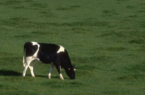

# Computer Vision ETH 2022

**Local Features**

- Harris corner detector

  

- Feature matching
 

**Image Classification with PyTorch**
- Multi layer Perceptron, CNN, Resnet18

**Object Detection**
 - Bag-of-words classifier, HoG descriptor
 - VGG Classifier
 
 **Image Segmentation**
 - SegNet
 - Mean shift with infinite radius and gaussian kernel
 
  
 
 **Condensation Tracker**
 - CONDENSATION algorithm based on color histogram of the target object

 

**Structure from Motion**
- Essential matrix, Point Triangulation, Absolute Pose, Reconstruction

  

**Model fitting with RANSAC**
- 2D Line fitting with RANSAC

 
 
 
